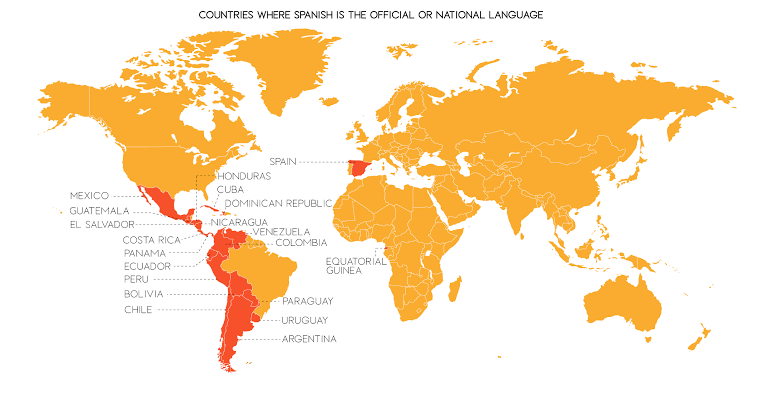

<h1>Welcome</h1>

Welcome to 1 to 1 Spanish lessons. This website specifically targets beginner learners of Spanish. It exposes them to the basics needed for one to be able to learn the language, this includes grammatical and cultural features as presented above within the navigation menue ^ . The tagert audience is versatile, this website works for anyone starting their language learning journey in Spanish.

  

    

      <a href="image/Map-of-Spanish-Speaking-Countries">
        
        

          
Spanish is the second most spoken language in the world

        

      </a>
    

  

  

    

      <a href="image/Hello.jpeg">
        
        

          
No matter what Spanish speaking country you are in, the word word for hello is Hola

        

      </a>
    

  

  

    

      <a href="image/vocabulary.jpg">
        
        

          
Examples of some vocabulary that is commonly used

        

      </a>
    

  

Here is a video that presents the vast amout of dialects and accents within the Spanish speaking world

<iframe width="560" height="315" src="https://www.youtube.com/embed/8DDrRjBqt-U" frameborder="0" allow="accelerometer; autoplay; clipboard-write; encrypted-media; gyroscope; picture-in-picture" allowfullscreen></iframe>
